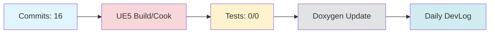

# Daily DevLog — 2025-11-10 (월)

**범위**: 2025-11-09 ~ 2025-11-10
**브랜치**: docs / 베이스: origin/main
**릴리즈 타겟**: N/A

---

## 1. 오늘의 핵심 변경 (Top Changes)

- [chore] chore(devlog): daily devlog 2025-11-10 — 영향: 유지보수

- [chore] chore: 불필요한 파일 삭제 및 워크플로우 수정 — 영향: 유지보수

- [other] Merge branch 'main' of https://github.com/doppleddiggong/Onepiece — 영향: 기타 변경

### Commit Heatmap
- 총 커밋: 16
- 변경 라인: +25756 / -3582
- 영향 파일: Doxyfile.template, Doxyfile, .claude/commands/self-assessment.md, Source/LatteLibrary/Character/Private/ALatteGameCharacter.cpp, Source/LatteLibrary/Character/Public/ALatteGameCharacter.h

---

## 2. 시스템 영향도 (Impact)

### 성능

- 로딩: 데이터 없음

### 안정성

- 크래시: 데이터 없음

### 네트워크

- 네트워크: 데이터 없음

---

## 3. 검증 (Verification)

### 빌드 (UE5)

- 빌드 정보 없음

### 테스트

- 테스트 결과 없음

### 정적분석

- 정적분석 결과 없음

---

## 4. 코드 문서화 변화 (Doxygen Delta)

- API 변화 없음

---

## 5. 리팩토링·위험 이슈

### 리팩토링

- 리팩토링 없음

### 위험

- 위험 항목 없음

---

## 6. 내일(Next)·미진(Action)

### Next

- 계획된 작업 없음

### 미진

- 미진 작업 없음

---

## 7. Mermaid 개요도

---

**생성 시간**: 2025-11-10 14:55:31
---

# 🎓 개발자 성장 피드백 (GPT-4 Analysis)

## 🤔 성찰 질문
- 왜 빌드 정보나 테스트 결과가 기록되지 않았는가? 자동화된 프로세스에 어떤 문제가 있었는지 확인해 볼 필요가 있습니다.
- 불필요한 파일을 제거하는 기준은 무엇이었는가? 이러한 기준이 팀의 다른 구성원에게도 명확하게 전달되고 있는가?
- 현재 워크플로우에서 어떤 부분이 가장 자주 수정되고 있는가? 반복적으로 수정되는 이유는 무엇인가?
- 이번 작업에서 변경된 내용이 장기적으로 유지보수에 어떤 영향을 미칠 수 있을까?

## 💡 대안 제시
- 빌드 및 테스트의 자동화를 강화하기 위해 CI/CD 파이프라인을 설정하고, 그 결과를 DevLog에 자동으로 포함시키는 방법을 고려해볼 수 있습니다.
- 불필요한 파일 및 워크플로우 수정 시, 변경 이력이 명확하게 기록되도록 주석이나 문서화를 강화하면 좋습니다.
- Doxygen이나 다른 문서화 도구의 효율적인 사용을 위해 자동화 스크립트를 작성하여 문서화를 일관되게 유지할 수 있습니다.

## 📚 학습 포인트
- **CI/CD 파이프라인**: Jenkins, GitHub Actions 등을 사용하여 자동으로 빌드, 테스트, 배포가 이루어지도록 설정하는 방법을 학습할 수 있습니다.
- **정적 코드 분석**: 코드 품질을 유지하기 위해 SonarQube 같은 도구를 활용하여 코드의 잠재적 결함을 사전에 발견하는 방법을 익힐 수 있습니다.
- **지속적인 문서화**: 코드 변경에 따라 문서화가 자동으로 업데이트되도록 설정하는 방법과 그 중요성을 이해할 수 있습니다.

## ⚠️ 주의 사항
- 빌드, 테스트 및 정적 분석의 결과가 기록되지 않으면 코드의 품질을 보장하기 어렵습니다. 이러한 부분을 시스템적으로 개선해야 합니다.
- 불필요한 파일 제거 과정에서 실수로 필요한 파일을 삭제할 위험이 있습니다. 항상 백업과 협업을 고려해 작업해야 합니다.
- 워크플로우 수정 시, 팀원들에게 변경 사항이 충분히 공유되지 않으면 혼란을 초래할 수 있습니다. 변경 사항을 공유할 효과적인 커뮤니케이션 채널이 필요합니다.

## 🎯 다음 단계 제안
- CI/CD 파이프라인을 설정하여 빌드와 테스트가 자동으로 실행되고 그 결과가 DevLog에 반영되도록 개선해보세요.
- 팀 내 코드리뷰 세션을 통해 불필요한 파일 관리 및 워크플로우 수정에 대한 베스트 프랙티스를 논의해보세요.
- 정적 분석 도구를 도입하여 코드의 품질을 높이는 방법을 연구하고 적용해보세요.
- 문서화의 중요성을 팀 차원에서 재고하고, 문서화 자동화 스크립트를 구축해보세요.

---

*이 피드백은 OpenAI GPT-4를 통해 자동 생성되었습니다. 참고용으로 활용하시고, 최종 판단은 개발자 본인이 내리시기 바랍니다.*
