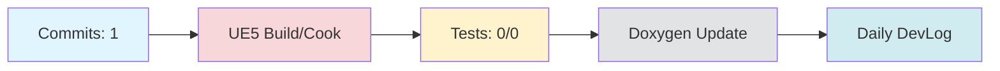

# Daily DevLog — 2025-11-11 (화)

**범위**: 2025-11-10 ~ 2025-11-11
**브랜치**: docs / 베이스: origin/main
**릴리즈 타겟**: N/A

---

## 1. 오늘의 핵심 변경 (Top Changes)

- [chore] chore(devlog): weekly report 2025-W46 — 영향: 유지보수

### Commit Heatmap
- 총 커밋: 1
- 변경 라인: +116 / -2
- 영향 파일: Documents/DevLog/Weekly/2025-W46-Summary.md, Documents/SUMMARY.md

---

## 2. 시스템 영향도 (Impact)

### 성능

- 로딩: 데이터 없음

### 안정성

- 크래시: 데이터 없음

### 네트워크

- 네트워크: 데이터 없음

---

## 3. 검증 (Verification)

### 빌드 (UE5)

- 빌드 정보 없음

### 테스트

- 테스트 결과 없음

### 정적분석

- 정적분석 결과 없음

---

## 4. 코드 문서화 변화 (Doxygen Delta)

- API 변화 없음

---

## 5. 리팩토링·위험 이슈

### 리팩토링

- 리팩토링 없음

### 위험

- 위험 항목 없음

---

## 6. 내일(Next)·미진(Action)

### Next

- 계획된 작업 없음

### 미진

- 미진 작업 없음

---

## 7. Mermaid 개요도

---

**생성 시간**: 2025-11-11 01:59:29