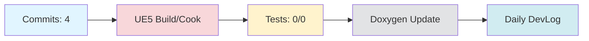

# Daily DevLog — 2025-11-11 (화)

**범위**:  ~ 
**브랜치**: main / 베이스: 
**릴리즈 타겟**: 

---

## 1. 오늘의 핵심 변경 (Top Changes)

- [feat] feat: AI 기반 자동 커밋 메시지 생성 도구 추가 — 영향: 기능 추가

- [other] Merge branch 'docs' of https://github.com/doppleddiggong/Onepiece — 영향: 기타 변경

- [chore] chore(devlog): daily devlog 2025-11-11 — 영향: 유지보수

### Commit Heatmap
- 총 커밋: 4
- 변경 라인: +707 / -123
- 영향 파일: N/A

---

## 2. 시스템 영향도 (Impact)

### 성능

- 로딩: 데이터 없음

### 안정성

- 크래시:  → 
- 실패 빌드: 

### 네트워크

- 네트워크: 데이터 없음

---

## 3. 검증 (Verification)

### 빌드 (UE5)

- 빌드 정보 없음

### 테스트

- 단위/통합/에디터 테스트: /

### 정적분석

- 경고:  → 
- 신규 심각도(High): 

---

## 4. 코드 문서화 변화 (Doxygen Delta)

- API 변화 없음

---

## 5. 리팩토링·위험 이슈

### 리팩토링

- 리팩토링 없음

### 위험

- 위험 항목 없음

---

## 6. 내일(Next)·미진(Action)

### Next

- 계획된 작업 없음

### 미진

- 미진 작업 없음

---

## 7. Mermaid 개요도

---

**생성 시간**: 2025-11-14 00:23:03 KST
## 3. 회의 연계 분석
이전 날짜의 회의록을 찾을 수 없습니다.

---

# 🎓 개발자 성장 피드백 (GPT-4 Analysis)

## 🤔 성찰 질문
1. AI 기반 자동 커밋 메시지 생성 도구를 추가했는데, 이 도구가 팀의 워크플로우에 어떤 긍정적/부정적 영향을 미칠 수 있을까요?
2. 현재 빌드 및 테스트 정보가 부족한데, 이를 개선하기 위해 어떤 접근 방법을 사용할 수 있을까요?
3. GitHub Actions 워크플로우를 개선하면서 어떤 부분이 가장 큰 도전 과제였나요?
4. 문서화와 관련된 변화가 없었는데, 문서화의 중요성을 어떻게 팀에 전달할 수 있을까요?

## 💡 대안 제시
- AI 기반 커밋 메시지 생성 도구가 팀의 코드베이스에 미치는 영향을 분석하기 위해, 도구 사용 전후의 커밋 메시지 품질을 비교해보는 것도 좋습니다.
- 빌드 및 테스트 자동화를 강화하기 위해 CI/CD 파이프라인에 더 많은 테스트 케이스와 빌드 환경을 추가하여 신뢰성을 높일 수 있습니다.
- 문서화를 자동화하는 도구나 프로세스를 도입하여 코드 변경 시 문서가 자동으로 업데이트되도록 할 수 있습니다.

## 📚 학습 포인트
- **AI 도구 통합**: AI 기반 도구를 개발 프로세스에 통합할 때의 장점과 단점, 그리고 이를 최적화하는 방법에 대해 배울 수 있습니다.
- **CI/CD 개선**: GitHub Actions를 활용한 워크플로우 최적화 방법과 안정성 강화에 대해 학습할 수 있습니다.
- **자동화의 중요성**: 자동화를 통해 개발 프로세스를 간소화하고, 반복적인 작업을 줄이는 방법에 대해 이해할 수 있습니다.

## ⚠️ 주의 사항
- AI 기반 커밋 메시지 도구가 팀의 코드 품질을 저하시킬 수 있는 가능성을 염두에 두고, 주기적인 검토와 피드백을 통해 개선해야 합니다.
- 빌드 및 테스트 정보가 부족한 상황은 코드 변경 시 문제를 발견하기 어렵게 만들 수 있으므로, 이를 개선하는 것이 중요합니다.
- 리팩토링의 부재는 기술 부채로 이어질 수 있으므로, 주기적으로 코드베이스를 검토하고 개선할 필요가 있습니다.

## 🎯 다음 단계 제안
- AI 기반 커밋 메시지 도구의 성능과 효율성을 평가하기 위한 사용자 피드백 세션을 계획해보세요.
- 빌드 및 테스트 자동화를 강화하기 위해, 팀 내에서 정기적인 코드 리뷰 세션을 통해 개선점을 논의하세요.
- 문서화 자동화 도구를 조사하고, 이를 팀의 개발 프로세스에 통합하여 문서화의 품질과 일관성을 높이세요.
- 리팩토링 계획을 수립하여 코드베이스의 유지보수성을 지속적으로 개선하세요.

---

*이 피드백은 OpenAI GPT-4를 통해 자동 생성되었습니다. 참고용으로 활용하시고, 최종 판단은 개발자 본인이 내리시기 바랍니다.*
