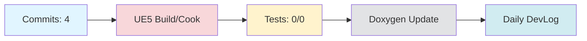

# Daily DevLog — 2025-11-13 (목)

**범위**: 2025-11-12 ~ 2025-11-13
**브랜치**: main / 베이스: origin/main
**릴리즈 타겟**: N/A

---

## 1. 오늘의 핵심 변경 (Top Changes)

- [feat] feat: AI 기반 자동 커밋 메시지 생성 도구 추가 — 영향: 기능 추가

- [other] Merge branch 'docs' of https://github.com/doppleddiggong/Onepiece — 영향: 기타 변경

- [chore] chore(devlog): daily devlog 2025-11-11 — 영향: 유지보수

### Commit Heatmap
- 총 커밋: 4
- 변경 라인: +707 / -123
- 영향 파일: Documents/DevLog/Daily/2025-11-11.md, Documents/DevLog/Weekly/2025-W46-Summary.md, Tools/CommitMessage/ai_gen_commit_msg.py, Tools/CommitMessage/install_commit_hook.py, Tools/CommitMessage/prompts/user_prompt.txt

---

## 2. 시스템 영향도 (Impact)

### 성능

- 로딩: 데이터 없음

### 안정성

- 크래시: 데이터 없음

### 네트워크

- 네트워크: 데이터 없음

---

## 3. 검증 (Verification)

### 빌드 (UE5)

- 빌드 정보 없음

### 테스트

- 테스트 결과 없음

### 정적분석

- 정적분석 결과 없음

---

## 4. 코드 문서화 변화 (Doxygen Delta)

- API 변화 없음

---

## 5. 리팩토링·위험 이슈

### 리팩토링

- 리팩토링 없음

### 위험

- 위험 항목 없음

---

## 6. 내일(Next)·미진(Action)

### Next

- 계획된 작업 없음

### 미진

- 미진 작업 없음

---

## 7. Mermaid 개요도

---

**생성 시간**: 2025-11-13 13:46:32
---

# 🎓 개발자 성장 피드백 (GPT-4 Analysis)

## 🤔 성찰 질문
- AI 기반 자동 커밋 메시지 생성 도구를 추가한 후, 팀의 커밋 메시지 품질이나 일관성에 어떤 영향을 미쳤나요?
- 현재의 작업 흐름에서 테스트와 검증 단계를 어떻게 강화할 수 있을까요?
- 문서화 개선을 위해 어떤 추가 도구나 방법을 사용할 수 있을까요?
- 워크플로우 권한 변경으로 인해 발생할 수 있는 보안 이슈는 없는지 검토해 보셨나요?
- 회의록 스캔 및 분류 로직 개선이 문서 관리에 실제로 얼마나 도움이 되었는지 어떻게 평가할 수 있을까요?

## 💡 대안 제시
- AI 기반 커밋 메시지 생성 도구는 커밋 메시지 컨벤션을 기반으로 학습하도록 하고, 팀의 피드백을 반영한 지속적인 개선을 고려해 보세요.
- 빌드, 테스트, 정적 분석 결과를 자동으로 수집하여 DevLog에 반영하는 스크립트를 작성하면 검증 단계를 강화할 수 있습니다.
- 문서화 자동화 도구로 Doxygen 외에 MkDocs와 같은 다른 옵션도 고려해 보세요. 특히, 마크다운 기반의 문서가 많을 경우 유용할 수 있습니다.
- 워크플로우 권한 변경 시, GitHub의 보안 설정을 검토하고, 필요한 경우, 컨텐츠에 대한 접근 로그를 활성화하세요.

## 📚 학습 포인트
- **AI Commit Generation**: 자연어 처리(NLP) 기반의 시스템이 어떻게 소프트웨어 개발 작업을 지원할 수 있는지 학습할 수 있습니다.
- **CI/CD 권한 관리**: GitHub Actions와 같은 CI/CD 도구의 권한 설정이 보안 및 운영에 미치는 영향을 이해할 수 있습니다.
- **문서화 자동화**: Doxygen과 같은 도구를 사용하여 코드 변경에 따른 문서화 자동화의 중요성을 느낄 수 있습니다.
- **워크플로우 트리거 관리**: 워크플로우의 트리거 조건을 설정하여 특정 이벤트에만 반응하도록 함으로써, 효율적인 빌드 및 배포 파이프라인을 구성할 수 있습니다.

## ⚠️ 주의 사항
- AI 기반 도구는 편리함을 제공하지만, 메시지의 정확성과 맥락을 사람이 검토하는 단계가 필요합니다.
- 테스트 및 빌드 정보가 불완전한 상태에서는 배포 시 예기치 않은 문제가 발생할 수 있습니다.
- 권한 변경은 팀의 작업 효율성을 높일 수 있지만, 보안 관점에서 충분히 검토되지 않으면 오히려 위험이 될 수 있습니다.
- 문서화 개선이 실제로 팀의 생산성 향상에 기여했는지에 대한 피드백이나 지표가 필요합니다.

## 🎯 다음 단계 제안
- AI 커밋 메시지 생성 도구의 성능 및 유용성을 주기적으로 평가하고, 필요에 따라 모델을 개선하거나 훈련 데이터를 업데이트하세요.
- CI/CD 파이프라인에 테스트 및 정적 분석을 자동화하는 작업을 추가하여, 품질 관리를 강화하세요.
- 팀 내에서 문서화의 일관성을 유지하기 위한 가이드라인을 마련하고, 모든 문서가 그에 맞춰 작성되도록 관리하세요.
- 워크플로우의 권한 및 보안 설정을 정기적으로 점검하고, 필요 시 보안 강화 조치를 취하세요.
- 회의록의 활용도를 높이기 위해, 회의 후 회고 및 피드백을 통해 개선점을 도출하고 다음 회의에 반영하세요.

---

*이 피드백은 OpenAI GPT-4를 통해 자동 생성되었습니다. 참고용으로 활용하시고, 최종 판단은 개발자 본인이 내리시기 바랍니다.*

## 1. 오늘의 핵심 변경
GPT summary not available (OPENAI_API_KEY missing).

## 2. 시스템 영향도
- ubt: {}
- cook: {}
- tests: {}
- static_analysis: {}

## 4. Mermaid 개요도
Commits: 4
Builds: 0
Tests: {}
Docs: 0

## 생성 시간
생성 시간: 2025-11-13 13:47:06 UTC
