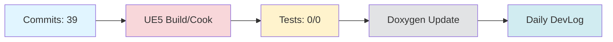

# Daily DevLog — 2025-11-12 (수)

**범위**:  ~ 
**브랜치**: main / 베이스: 
**릴리즈 타겟**: 

---

## 1. 오늘의 핵심 변경 (Top Changes)

- [feat] feat: DevLog 자동 갱신 및 HonKit 배포 파이프라인 안정화 — 영향: 기능 추가

- [feat] feat(honkit): 회의록 감지 및 디스코드 알림 통합 — 영향: 기능 추가

- [feat] feat: 회의록 알림 워크플로우에 소스 브랜치 선택 기능 추가 — 영향: 기능 추가

### Commit Heatmap
- 총 커밋: 39
- 변경 라인: +2724 / -749
- 영향 파일: N/A

---

## 2. 시스템 영향도 (Impact)

### 성능

- 로딩: 데이터 없음

### 안정성

- 크래시:  → 
- 실패 빌드: 

### 네트워크

- 네트워크: 데이터 없음

---

## 3. 검증 (Verification)

### 빌드 (UE5)

- 빌드 정보 없음

### 테스트

- 단위/통합/에디터 테스트: /

### 정적분석

- 경고:  → 
- 신규 심각도(High): 

---

## 4. 코드 문서화 변화 (Doxygen Delta)

- API 변화 없음

---

## 5. 리팩토링·위험 이슈

### 리팩토링

- 리팩토링 없음

### 위험

- 위험 항목 없음

---

## 6. 내일(Next)·미진(Action)

### Next

- 계획된 작업 없음

### 미진

- 미진 작업 없음

---

## 7. Mermaid 개요도

---

**생성 시간**: 2025-11-14 00:26:52 KST
## 3. 회의 연계 분석
이전 날짜의 회의록을 찾을 수 없습니다.

---

# 🎓 개발자 성장 피드백 (GPT-4 Analysis)

## 🤔 성찰 질문
1. DevLog 자동 갱신 및 HonKit 배포 파이프라인을 안정화하는 과정에서 어떤 부분이 가장 도전적이었나요? 그리고 그 도전을 어떻게 극복했나요?
2. 회의록 감지 및 디스코드 알림 통합 기능을 구현하면서 어떤 기술적 결정이 가장 중요했나요? 그 결정은 어떤 결과를 가져왔나요?
3. 소스 브랜치 선택 기능을 추가하면서 사용자 경험(UX)에 어떤 영향을 미쳤는지 고민해보셨나요?
4. 빌드 및 테스트 과정에서 데이터가 부족한 상황을 어떻게 해결할 수 있을까요?

## 💡 대안 제시
- **테스트 자동화**: 현재 테스트가 이루어지지 않은 것으로 보입니다. 단위 테스트 및 통합 테스트를 자동화하여 코드 변경 시 안정성을 확보하는 것이 중요합니다.
- **코드 리뷰 강화**: 많은 커밋이 이루어졌지만, 코드 리뷰 프로세스가 명확하지 않습니다. 효과적인 코드 리뷰를 통해 코드 품질을 높일 수 있습니다.
- **모니터링 도구 도입**: 성능 및 안정성 데이터를 수집할 수 있는 모니터링 도구를 도입하여 시스템 상태를 지속적으로 점검할 수 있습니다.

## 📚 학습 포인트
- **CI/CD 파이프라인 설계**: DevLog와 HonKit 배포 파이프라인을 안정화하는 과정에서 CI/CD의 중요성과 설계 패턴을 학습할 수 있습니다.
- **웹훅(Webhook) 활용**: 회의록 감지 및 디스코드 알림 통합에서 웹훅을 활용한 자동화의 장점을 배울 수 있습니다.
- **Git 브랜치 전략**: 소스 브랜치 선택 기능 추가를 통해 Git 브랜치 관리의 중요성과 전략적 사용법을 이해할 수 있습니다.

## ⚠️ 주의 사항
- **테스트 부족**: 테스트가 이루어지지 않은 상태에서 기능을 추가하는 것은 버그를 유발할 수 있습니다. 테스트 커버리지를 높이는 것이 필요합니다.
- **문서화 부족**: API 변화가 없다고 하지만, 코드 변경 시 문서화가 부족하면 유지보수에 어려움이 있을 수 있습니다.
- **성능 측정**: 성능 관련 데이터가 부족한 상황에서 성능 저하가 발생할 수 있습니다. 성능 측정 및 최적화 방안을 고려해야 합니다.

## 🎯 다음 단계 제안
- **테스트 커버리지 확대**: 현재의 기능에 대한 단위 테스트 및 통합 테스트를 작성하여 커버리지를 확대하세요.
- **성능 및 안정성 모니터링**: 성능 및 안정성 데이터를 수집할 수 있는 모니터링 시스템을 구축하여 지속적인 개선을 도모하세요.
- **사용자 피드백 수집**: 회의록 알림 워크플로우의 사용자 경험을 개선하기 위해 사용자 피드백을 수집하고 반영하는 프로세스를 마련하세요.

---

*이 피드백은 OpenAI GPT-4를 통해 자동 생성되었습니다. 참고용으로 활용하시고, 최종 판단은 개발자 본인이 내리시기 바랍니다.*
