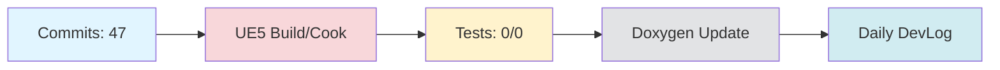

# Daily DevLog — 2025-11-13 (목)

**범위**:  ~ 
**브랜치**: main / 베이스: 
**릴리즈 타겟**: 

---

## 1. 오늘의 핵심 변경 (Top Changes)

- [feat] feat: 자동 PR 생성 샘플 스크립트 추가 — 영향: 기능 추가

- [feat] feat: 자동 PR 본문 생성 스크립트와 템플릿 추가 — 영향: 기능 추가

- [feat] feat: 일일 개발 로그 통합 생성 스크립트 추가 및 워크플로우 개선 — 영향: 기능 추가

### Commit Heatmap
- 총 커밋: 47
- 변경 라인: +3018 / -1199
- 영향 파일: N/A

---

## 2. 시스템 영향도 (Impact)

### 성능

- 로딩: 데이터 없음

### 안정성

- 크래시:  → 
- 실패 빌드: 

### 네트워크

- 네트워크: 데이터 없음

---

## 3. 검증 (Verification)

### 빌드 (UE5)

- 빌드 정보 없음

### 테스트

- 단위/통합/에디터 테스트: /

### 정적분석

- 경고:  → 
- 신규 심각도(High): 

---

## 4. 코드 문서화 변화 (Doxygen Delta)

- API 변화 없음

---

## 5. 리팩토링·위험 이슈

### 리팩토링

- 리팩토링 없음

### 위험

- 위험 항목 없음

---

## 6. 내일(Next)·미진(Action)

### Next

- 계획된 작업 없음

### 미진

- 미진 작업 없음

---

## 7. Mermaid 개요도

---

**생성 시간**: 2025-11-14 01:52:44 KST
## 3. 회의 연계 분석
In today's meeting, the team discussed the completion of the project plan and the division of technical modules, which will be addressed in the next meeting. This aligns with the recent commits, particularly the addition of scripts for automatic PR generation, which can streamline the project workflow and enhance collaboration.

Additionally, the team is organizing Jira and Notion invitation emails, assigned to 재진 and 민우, indicating preparation for improved project management tools that will support the ongoing development efforts.

While the meeting's action items are progressing, the division of technical modules remains pending for further discussion. Overall, the recent commits reflect proactive steps towards enhancing development efficiency and collaboration.

---

# 🎓 개발자 성장 피드백 (GPT-4 Analysis)

## 🤔 성찰 질문
1. 자동 PR 생성 및 본문 템플릿을 추가하는 과정에서, 어떤 방식으로 PR의 품질을 높일 수 있을까요? 예를 들어, PR 리뷰어에게 필요한 정보를 어떻게 더 명확히 제공할 수 있을까요?
2. 일일 개발 로그 통합 생성 스크립트를 추가하면서, 로그의 가독성과 유용성을 높이기 위해 어떤 추가적인 정보를 포함할 수 있을까요?
3. 현재 워크플로우 개선 과정에서 가장 큰 장애물은 무엇이었으며, 이를 어떻게 극복했나요?
4. 커밋 히트맵에서 47개의 커밋이 발생했는데, 커밋의 빈도와 크기가 적절했는지, 혹은 더 나은 방법이 있을지 고민해보셨나요?
5. 테스트가 수행되지 않았는데, 테스트 자동화를 통해 얻을 수 있는 이점은 무엇일까요?

## 💡 대안 제시
- 자동 PR 생성 시, PR의 중요도나 변경 사항의 범위에 따라 템플릿을 다르게 적용하는 방안을 고려해 보세요. 예를 들어, 주요 기능 추가와 버그 수정에 대해 다른 템플릿을 사용할 수 있습니다.
- 일일 개발 로그에 시스템 성능 지표나 주요 메트릭을 시각화하는 방법을 추가하면, 로그의 효용성을 높일 수 있습니다. 이를 통해 팀원들이 쉽게 시스템 상태를 파악할 수 있습니다.

## 📚 학습 포인트
- **자동화 스크립트 작성**: 자동화된 스크립트는 개발 효율성을 크게 향상시킬 수 있습니다. 이러한 스크립트를 작성할 때는 재사용성과 확장성을 고려해야 합니다.
- **Git 워크플로우 개선**: GitHub Actions와 같은 CI/CD 도구를 사용하여 문서화 및 배포 프로세스를 자동화하는 방법을 배울 수 있습니다.
- **커밋 관리**: 커밋의 크기와 빈도를 적절히 조절하는 것은 코드 리뷰를 용이하게 하고, 변경 사항을 추적하기 쉽게 만듭니다.

## ⚠️ 주의 사항
- 자동화 스크립트가 예상치 못한 방식으로 동작할 수 있으므로, 충분한 테스트를 통해 안정성을 확보해야 합니다.
- 테스트가 수행되지 않은 상태에서 코드 변경이 진행되면, 잠재적인 버그가 코드에 포함될 위험이 있습니다. 따라서 테스트 자동화가 필요합니다.
- 대량의 코드 변경이 이루어질 경우, 코드 리뷰가 어려워질 수 있으므로 커밋의 크기를 적절히 관리하는 것이 중요합니다.

## 🎯 다음 단계 제안
- 자동 PR 생성 스크립트에 대한 사용자 피드백을 수집하고, 이를 바탕으로 템플릿을 개선하는 작업을 진행해 보세요.
- 테스트 자동화 시스템을 구축하여, 코드 변경 시 자동으로 테스트가 수행되도록 설정해 보세요. 이는 코드의 안정성을 높이는 데 크게 기여할 것입니다.
- 일일 개발 로그에 메트릭 대시보드를 추가하여, 팀원들이 시스템 상태를 한눈에 파악할 수 있도록 개선해 보세요.

---

*이 피드백은 OpenAI GPT-4를 통해 자동 생성되었습니다. 참고용으로 활용하시고, 최종 판단은 개발자 본인이 내리시기 바랍니다.*
