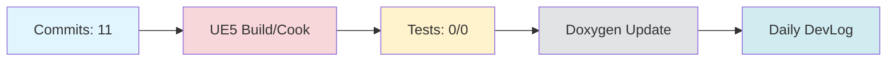

# Daily DevLog — 2025-11-14 (금)

**범위**:  ~ 
**브랜치**: main / 베이스: 
**릴리즈 타겟**: 

---

## 1. 오늘의 핵심 변경 (Top Changes)

- [fix] fix(ci): Discord 웹훅 오류 복구 — 영향: 버그 수정

- [fix] Fix meeting workflow outputs and preserve pages artifacts — 영향: 버그 수정

- [fix] Fix workflow permissions and checkout — 영향: 버그 수정

### Commit Heatmap
- 총 커밋: 11
- 변경 라인: +1048 / -55
- 영향 파일: N/A

---

## 2. 시스템 영향도 (Impact)

### 성능

- 로딩: 데이터 없음

### 안정성

- 크래시:  → 
- 실패 빌드: 

### 네트워크

- 네트워크: 데이터 없음

---

## 3. 검증 (Verification)

### 빌드 (UE5)

- 빌드 정보 없음

### 테스트

- 단위/통합/에디터 테스트: /

### 정적분석

- 경고:  → 
- 신규 심각도(High): 

---

## 4. 코드 문서화 변화 (Doxygen Delta)

- API 변화 없음

---

## 5. 리팩토링·위험 이슈

### 리팩토링

- 리팩토링 없음

### 위험

- 위험 항목 없음

---

## 6. 내일(Next)·미진(Action)

### Next

- 계획된 작업 없음

### 미진

- 미진 작업 없음

---

## 7. Mermaid 개요도

---

**생성 시간**: 2025-11-15 16:31:47 KST
## 3. 회의 연계 분석
회의 항목과 오늘의 커밋 내용을 연결하여 요약하겠습니다.

### 회의 항목 및 진행 상황

1. **입국 절차/호텔/주문 시나리오 Flow**:
   - **진행 상황**: 클라이언트 팀이 담당하며 기한은 2025-11-14. 현재 진행 상황은 미제공.

2. **캐릭터 외형·역할 정의 및 프로토타입 작성**:
   - **진행 상황**: 아트·클라이언트 팀이 담당하며 기한은 2025-11-15. 현재 진행 상황은 미제공.

3. **Base64 기반 API 샘플 데이터 송수신 구조 문서화**:
   - **진행 상황**: 클라이언트 팀이 담당하며 기한은 2025-11-16. 현재 진행 상황은 미제공.

4. **Whisper STT + TTS 연동 테스트 및 로컬 한국어 모델 후보 검토**:
   - **진행 상황**: AI 팀이 담당하며 기한은 2025-11-15. 현재 진행 상황은 미제공.

5. **VectorDB 기반 RAG 구조와 API 프로토콜 문서화 초안 작성**:
   - **진행 상황**: AI 팀이 담당하며 기한은 2025-11-17. 현재 진행 상황은 미제공.

6. **커밋 메시지 자동화와 지라/컨플루언스 구조 연결 완성**:
   - **진행 상황**: DevOps 팀이 담당하며 기한은 2025-11-15. **진행 상황**: "fix(ci): Discord 웹훅 오류 복구" 및 관련 커밋에서 워크플로우 권한 및 체크아웃 수정이 이루어졌음.

7. **회의록과 DevLog 자동화 루틴 점검**:
   - **진행 상황**: 운영팀이 담당하며 기한은 2025-11-15. 현재 진행 상황은 미제공.

### 커밋 요약
- **진행된 작업**: Discord 웹훅 오류 복구, 회의 워크플로우 출력 수정 및 페이지 아티팩트 보존, 워크플로우 권한 및 체크아웃 수정.
- **대기 중인 항목**: 입국 절차/호텔/주문 시나리오 Flow, 캐릭터 외형 정의, Base64 API 문서화, Whisper STT/TTS 연동, VectorDB 기반 RAG 문서화, 회의록 및 DevLog 자동화 점검.

위의 내용을 통해 현재 진행 중인 항목과 커밋의 연관성을 확인할 수 있습니다.

---

# 🎓 개발자 성장 피드백 (GPT-4 Analysis)

## 🤔 성찰 질문
1. 왜 Discord 웹훅 오류가 발생했는지, 그 근본 원인은 무엇이었을까요?
2. 워크플로우의 권한 및 체크아웃 문제를 해결하기 위해 어떤 접근 방식을 사용하셨나요?
3. 테스트가 수행되지 않은 이유는 무엇이며, 이를 어떻게 개선할 수 있을까요?
4. 변경된 코드의 안정성을 어떻게 검증할 수 있을까요?

## 💡 대안 제시
1. **테스트 자동화**: CI/CD 파이프라인에 자동화된 테스트를 추가하여 변경 사항의 안정성을 즉시 확인할 수 있도록 설정하는 것을 고려해보세요.
2. **코드 리뷰 프로세스 강화**: 워크플로우 관련 문제를 사전에 방지하기 위해 코드 리뷰 프로세스를 강화하고, 관련 문서를 보강하는 것도 도움이 될 수 있습니다.
3. **로그 및 모니터링**: Discord 웹훅 오류와 같은 문제를 빠르게 감지하기 위해 로그 및 모니터링 시스템을 강화하여 실시간 알림을 받을 수 있도록 설정하는 것을 고려해보세요.

## 📚 학습 포인트
1. **CI/CD 파이프라인**: 지속적 통합 및 배포 파이프라인에서의 권한 관리와 체크아웃 절차에 대한 이해를 높일 수 있는 기회입니다.
2. **웹훅(Webhook)**: 웹훅의 작동 방식과 이를 활용한 외부 서비스와의 통합 방법에 대해 학습할 수 있습니다.
3. **문서화의 중요성**: 변경 사항이나 수정된 버그에 대한 문서화를 통해 팀 내 지식 공유 및 유지보수성을 높이는 방법을 배울 수 있습니다.

## ⚠️ 주의 사항
1. **테스트 미흡**: 테스트가 수행되지 않은 상태에서의 배포는 예기치 않은 버그를 초래할 수 있습니다. 테스트 커버리지를 높이는 방안을 고려하세요.
2. **기술 부채**: 워크플로우 및 CI/CD 설정과 관련된 기술 부채가 쌓이지 않도록 주기적인 점검과 개선 작업을 수행해야 합니다.
3. **빌드 정보 부족**: 빌드 정보가 부족하면 문제 발생 시 원인을 추적하기 어려울 수 있으니, 빌드 로그 및 결과를 체계적으로 관리하세요.

## 🎯 다음 단계 제안
1. **테스트 커버리지 확대**: 단위 테스트 및 통합 테스트를 추가하여 코드 변경의 안정성을 높이세요.
2. **CI/CD 개선**: 워크플로우의 자동화 수준을 높이고, 권한 및 체크아웃 관련 문제를 사전에 방지할 수 있는 방안을 모색하세요.
3. **문서화 강화**: 변경 사항 및 버그 수정 내역을 보다 상세히 기록하여 팀 내 지식 공유를 촉진하세요.
4. **리팩토링 계획 수립**: 코드 및 워크플로우의 복잡도를 줄이기 위한 리팩토링 계획을 수립하여 장기적으로 유지보수성을 높이세요.

---

*이 피드백은 OpenAI GPT-4를 통해 자동 생성되었습니다. 참고용으로 활용하시고, 최종 판단은 개발자 본인이 내리시기 바랍니다.*
