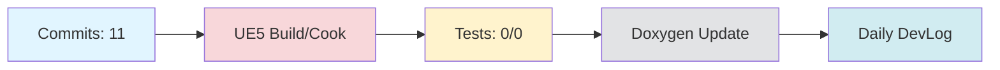

# Daily DevLog — 2025-11-14 (금)

**범위**:  ~ 
**브랜치**: main / 베이스: 
**릴리즈 타겟**: 

---

## 1. 오늘의 핵심 변경 (Top Changes)

- [fix] fix(ci): Discord 웹훅 오류 복구 — 영향: 버그 수정

- [fix] Fix meeting workflow outputs and preserve pages artifacts — 영향: 버그 수정

- [fix] Fix workflow permissions and checkout — 영향: 버그 수정

### Commit Heatmap
- 총 커밋: 11
- 변경 라인: +1048 / -55
- 영향 파일: N/A

---

## 2. 시스템 영향도 (Impact)

### 성능

- 로딩: 데이터 없음

### 안정성

- 크래시:  → 
- 실패 빌드: 

### 네트워크

- 네트워크: 데이터 없음

---

## 3. 검증 (Verification)

### 빌드 (UE5)

- 빌드 정보 없음

### 테스트

- 단위/통합/에디터 테스트: /

### 정적분석

- 경고:  → 
- 신규 심각도(High): 

---

## 4. 코드 문서화 변화 (Doxygen Delta)

- API 변화 없음

---

## 5. 리팩토링·위험 이슈

### 리팩토링

- 리팩토링 없음

### 위험

- 위험 항목 없음

---

## 6. 내일(Next)·미진(Action)

### Next

- 계획된 작업 없음

### 미진

- 미진 작업 없음

---

## 7. Mermaid 개요도

```mermaid
flowchart LR
  Dev[Commits: 11] --> Build[UE5 Build/Cook]
  Build --> Test[Tests: 0/0]
  Test --> Doc[Doxygen Update]
  Doc --> Daily[Daily DevLog]

  style Dev fill:#e1f5ff
  style Build fill:#f8d7da
  style Test fill:#fff3cd
  style Doc fill:#e2e3e5
  style Daily fill:#d1ecf1
```

---

**생성 시간**: 2025-11-16 10:05:12 KST
## 3. 회의 연계 분석
회의 항목과 오늘의 커밋 내용을 연결하면 다음과 같습니다:

1. **OT(온보딩)**: 현재 커밋에서는 직접적인 관련 내용이 없으나, 입국 절차/호텔/주문 시나리오 Flow 완성이 필요합니다. (담당: 클라이언트 팀, 기한: 2025-11-14)

2. **캐릭터 외형**: 캐릭터 외형·역할 정의 및 프로토타입 작성이 필요합니다. (담당: 아트·클라이언트, 기한: 2025-11-15) 관련 커밋 없음.

3. **시나리오**: 시나리오 Flow 완성 작업이 진행 중이며, 커밋과 직접적인 연관은 없습니다.

4. **DevOps**: 커밋 메시지 자동화와 지라/컨플루언스 구조 연결이 필요합니다. 오늘의 커밋에서 워크플로우 권한과 체크아웃 수정이 이루어졌습니다. 이는 DevOps 작업과 연관이 있습니다.

5. **Base64**: Base64 기반 API 문서화 작업이 진행 중이며, 커밋과의 연결은 없음.

6. **RAG**: VectorDB 기반 RAG 구조와 API 프로토콜 문서화 초안 작업이 필요하나, 관련 커밋 없음.

7. **지라/Confluence**: 오늘의 커밋에서 지라와 관련된 워크플로우 수정이 이루어졌습니다.

8. **Flow**: 회의록과 DevLog 자동화 루틴 점검이 필요하나, 커밋과의 연결은 없음.

**요약**: 오늘의 커밋에서 DevOps 관련 작업(워크플로우 수정)이 진행되었으며, 지라와 관련된 부분이 반영되었습니다. 나머지 항목들은 아직 진행 중입니다.

---

# 🎓 개발자 성장 피드백 (GPT-4 Analysis)

## 🤔 성찰 질문
1. Discord 웹훅 오류를 수정할 때, 오류의 근본 원인을 어떻게 분석했나요? 유사한 문제가 발생하지 않도록 예방할 수 있는 방법이 있을까요?
2. 워크플로우 권한 및 체크아웃 오류를 해결하면서, CI/CD 파이프라인의 구성 요소들을 얼마나 이해하고 있었나요? 더 깊이 이해하기 위해 어떤 자료를 참고할 수 있을까요?
3. 변경된 라인이 많지만 영향 파일이 명시되지 않았습니다. 어떤 파일들이 변경되었고, 그 변경이 시스템에 미치는 영향을 어떻게 평가할 수 있을까요?
4. 테스트가 수행되지 않았는데, 변경 사항이 시스템에 미칠 수 있는 영향을 어떻게 검증할 계획인가요?
5. 리팩토링 및 위험 항목이 없다고 기록했는데, 장기적인 관점에서 코드의 품질과 유지보수성을 어떻게 향상시킬 수 있을까요?

## 💡 대안 제시
- Discord 웹훅 오류와 같은 문제를 해결할 때, 특정 오류에 대한 핫픽스보다는 근본적인 문제 해결을 위한 로그 및 모니터링 시스템을 구축하는 것도 고려해보세요.
- CI/CD 파이프라인에서 권한과 체크아웃 문제를 해결할 때, 권한 설정을 자동화하거나, 권한 변경 감시 시스템을 도입하는 방법도 검토해볼 수 있습니다.

## 📚 학습 포인트
- **CI/CD 파이프라인**: CI/CD의 기본 개념과 Jenkins, GitHub Actions 등의 도구를 활용한 파이프라인 설정 방법을 학습하세요.
- **웹훅(Webhook)**: 웹훅의 작동 원리와 오류 처리 방법을 이해하고, 이를 활용한 자동화 및 알림 시스템 구축 방법을 탐구해보세요.
- **버전 관리**: Git의 브랜치 전략과 커밋 메시지 작성 방법을 학습하여, 협업 시 코드 변경 사항을 명확하게 전달할 수 있도록 하세요.

## ⚠️ 주의 사항
- 테스트가 충분히 수행되지 않은 상태에서 변경 사항을 배포할 경우, 예상치 못한 버그가 발생할 수 있습니다. 자동화된 테스트를 강화하고, 변경 사항에 대한 테스트 커버리지를 늘리세요.
- 문서화가 부족할 경우, 팀원들이나 미래의 자신이 코드를 이해하는 데 어려움을 겪을 수 있습니다. 코드 변경 시 적절한 주석과 문서화를 추가하세요.

## 🎯 다음 단계 제안
- **테스트 자동화**: 현재 테스트가 수행되지 않은 부분에 대해 자동화된 테스트를 추가하여, 코드 변경의 안정성을 높이세요.
- **모니터링 시스템 구축**: 웹훅 및 CI/CD 파이프라인의 오류를 사전에 감지할 수 있는 모니터링 시스템을 구축하여, 문제 발생 시 신속하게 대응할 수 있도록 하세요.
- **기술 부채 관리**: 주기적으로 코드베이스를 검토하고, 리팩토링 기회를 식별하여 기술 부채를 줄여나가세요. 이를 통해 장기적인 유지보수성을 확보할 수 있습니다.

---

*이 피드백은 OpenAI GPT-4를 통해 자동 생성되었습니다. 참고용으로 활용하시고, 최종 판단은 개발자 본인이 내리시기 바랍니다.*
