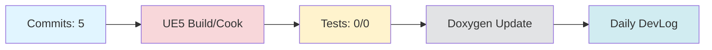

# Daily DevLog — 2025-11-16 (일)

**범위**:  ~ 
**브랜치**: main / 베이스: 
**릴리즈 타겟**: 

---

## 1. 오늘의 핵심 변경 (Top Changes)

- [fix] fix(ci): correct daily-report workflow date logic to use yesterday — 영향: 버그 수정

- [chore] chore(devlog): daily devlog 2025-11-15 — 영향: 유지보수

- [chore] chore(devlog): daily devlog 2025-11-14 — 영향: 유지보수

### Commit Heatmap
- 총 커밋: 5
- 변경 라인: +394 / -72
- 영향 파일: N/A

---

## 2. 시스템 영향도 (Impact)

### 성능

- 로딩: 데이터 없음

### 안정성

- 크래시:  → 
- 실패 빌드: 

### 네트워크

- 네트워크: 데이터 없음

---

## 3. 검증 (Verification)

### 빌드 (UE5)

- 빌드 정보 없음

### 테스트

- 단위/통합/에디터 테스트: /

### 정적분석

- 경고:  → 
- 신규 심각도(High): 

---

## 4. 코드 문서화 변화 (Doxygen Delta)

- API 변화 없음

---

## 5. 리팩토링·위험 이슈

### 리팩토링

- 리팩토링 없음

### 위험

- 위험 항목 없음

---

## 6. 내일(Next)·미진(Action)

### Next

- 계획된 작업 없음

### 미진

- 미진 작업 없음

---

## 7. Mermaid 개요도

---

**생성 시간**: 2025-11-16 15:36:25 KST
## 3. 회의 연계 분석
이전 날짜의 회의록을 찾을 수 없습니다.

---

# 🎓 개발자 성장 피드백 (GPT-4 Analysis)

## 🤔 성찰 질문
1. 왜 현재 빌드 및 테스트 정보를 기록하지 않았나요? 이러한 정보가 무엇을 개선하는 데 도움이 될 수 있을까요?
2. "fix(ci)" 커밋에서 날짜 논리를 수정한 이유는 무엇인지, 그리고 이러한 논리 오류가 발생한 근본 원인은 무엇일까요?
3. 현재 시스템에 대한 성능 및 네트워크 데이터를 수집하지 않은 이유는 무엇인가요? 이러한 데이터가 어떻게 시스템 개선에 기여할 수 있을까요?
4. 리팩토링이나 위험 요소가 기록되지 않은 이유는 무엇인가요? 현재 코드베이스에서 잠재적인 개선 영역이 있을까요?

## 💡 대안 제시
- 빌드 및 테스트 자동화 스크립트를 개선하여 매일의 빌드 및 테스트 결과를 DevLog에 자동으로 포함시키는 방법을 고려해보세요. 이를 통해 지속적인 통합 및 배포 파이프라인의 신뢰성을 높일 수 있습니다.
- 성능 및 네트워크 데이터 수집을 자동화하여 DevLog에 포함시키는 방법을 탐색해 보세요. 예를 들어, APM(Application Performance Management) 도구를 활용할 수 있습니다.

## 📚 학습 포인트
- **CI/CD 파이프라인**: 지속적인 통합 및 배포 파이프라인에서 날짜 관련 논리를 처리하는 방법에 대해 더 학습할 수 있습니다.
- **정적 분석 도구**: 코드 품질을 유지하고 개선하기 위해 정적 분석 도구를 어떻게 효과적으로 활용할 수 있는지에 대해 배울 수 있습니다.
- **자동화된 문서화**: Doxygen과 같은 도구를 사용하여 코드 문서화를 자동화하는 방법에 대해 더 알아볼 수 있습니다.

## ⚠️ 주의 사항
- 현재 빌드 및 테스트 정보가 누락되어 있어 코드 변경이 실제로 시스템에 어떤 영향을 미쳤는지 명확하지 않습니다. 이는 잠재적인 기술 부채로 이어질 수 있습니다.
- CI/CD 워크플로우에서 날짜 처리와 관련된 논리 오류는 다른 부분에서도 발생할 수 있으므로, 전반적인 검토가 필요할 수 있습니다.

## 🎯 다음 단계 제안
- 빌드 및 테스트 자동화 스크립트를 개선하여 DevLog에 관련 정보를 자동으로 기록할 수 있도록 설정해보세요.
- 성능 및 네트워크 모니터링 도구를 통합하여 정기적으로 데이터를 수집하고 분석하는 프로세스를 구축해보세요.
- 정적 분석 도구의 경고를 검토하고, 이를 통해 코드 품질을 높이는 방법을 모색해보세요.

---

*이 피드백은 OpenAI GPT-4를 통해 자동 생성되었습니다. 참고용으로 활용하시고, 최종 판단은 개발자 본인이 내리시기 바랍니다.*
