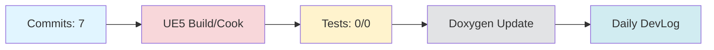

# Daily DevLog — 2025-11-18 (화)

**범위**:  ~ 
**브랜치**: main / 베이스: 
**릴리즈 타겟**: 

---

## 1. 오늘의 핵심 변경 (Top Changes)

- [other] Update KLingo_251118_Presentation_Report.md — 영향: 기타 변경

- [other] Merge pull request #38 from doppleddiggong/dopple — 영향: 기타 변경

- [docs] docs : 기획발표 기록 저장 — 영향: 문서 업데이트

### Commit Heatmap
- 총 커밋: 7
- 변경 라인: +7097 / -7
- 영향 파일: N/A

---

## 2. 시스템 영향도 (Impact)

### 성능

- 로딩: 데이터 없음

### 안정성

- 크래시:  → 
- 실패 빌드: 

### 네트워크

- 네트워크: 데이터 없음

---

## 3. 검증 (Verification)

### 빌드 (UE5)

- 빌드 정보 없음

### 테스트

- 단위/통합/에디터 테스트: /

### 정적분석

- 경고:  → 
- 신규 심각도(High): 

---

## 4. 코드 문서화 변화 (Doxygen Delta)

- API 변화 없음

---

## 5. 리팩토링·위험 이슈

### 리팩토링

- 리팩토링 없음

### 위험

- 위험 항목 없음

---

## 6. 내일(Next)·미진(Action)

### Next

- 계획된 작업 없음

### 미진

- 미진 작업 없음

---

## 7. Mermaid 개요도

---

**생성 시간**: 2025-11-19 08:39:31 KST
## 3. 회의 연계 분석
회의 항목과 오늘의 커밋 내용을 연결하여 요약하겠습니다.

1. **투두리스트 및 간트차트 초안 생성** (담당: 클라팀, 기한: 11/18)
   - **진행 상황**: 관련 커밋 없음. 기한 내 완료 필요.

2. **멀티플레이 이벤트 처리 구조 명세화** (담당: 클라팀, 기한: 11/20)
   - **진행 상황**: 관련 커밋 없음. 기한 내 완료 필요.

3. **필기 UI 인식 테스트용 샘플 3개 제공** (담당: AI팀, 기한: 11/18)
   - **진행 상황**: 관련 커밋 없음. 기한 내 완료 필요.

4. **STT/TTS/OCR 프로토 범위 기능 정의** (담당: AI팀, 기한: 11/19)
   - **진행 상황**: 관련 커밋 없음. 기한 내 완료 필요.

5. **TailScale VPN 환경 구축 및 접속 검증** (담당: DevOps, 기한: 11/19)
   - **진행 상황**: 관련 커밋 없음. 기한 내 완료 필요.

6. **발표자료 최종 점검 및 백업 질문 리스트 정리** (담당: 문서 담당, 기한: 11/18)
   - **진행 상황**: 관련 커밋 없음. 기한 내 완료 필요.

7. **Jira 스페이스 통합 계획 및 Epic 구조 재정렬** (담당: PM/DevOps, 기한: 11/20)
   - **진행 상황**: 관련 커밋 없음. 기한 내 완료 필요.

**Metrics 요약**:
- KLingo_251118_Presentation_Report.md 업데이트
- PR #38 병합
- 기획발표 기록 저장 관련 문서 작업

**전체 요약**: 오늘의 커밋은 회의에서 논의된 항목들과 직접적으로 연결되지 않았습니다. 모든 항목이 기한 내 완료를 위해 추가적인 진행이 필요합니다.

---

# 🎓 개발자 성장 피드백 (GPT-4 Analysis)

## 🤔 성찰 질문
1. 왜 오늘의 작업에서 대부분의 변경 사항이 문서 업데이트에 집중되었나요? 코드 변경이나 기능 추가가 필요하지 않았던 이유는 무엇인가요?
2. 빌드 및 테스트 관련 정보가 없는 이유는 무엇인가요? 이를 통해 시스템의 안정성을 어떻게 보장할 수 있을까요?
3. 변경된 문서가 프로젝트의 전반적인 목표나 방향에 어떻게 기여하는지 명확히 이해하고 있나요?

## 💡 대안 제시
- 문서 업데이트 작업이 주를 이루었다면, 문서 자동화를 고려해보세요. 예를 들어, 특정 형식의 문서가 자주 업데이트된다면 스크립트를 통해 자동화할 수 있습니다.
- 빌드 및 테스트 자동화 파이프라인을 설정하여, 코드 변경이 있을 때마다 자동으로 빌드 및 테스트가 수행되도록 하는 것을 고려해 보세요. 이는 시스템의 안정성을 높이는 데 도움이 됩니다.

## 📚 학습 포인트
- **Continuous Integration (CI)**: 지속적인 통합을 통해 코드 변경 시마다 자동으로 빌드 및 테스트가 수행되도록 설정하는 방법을 학습할 수 있습니다.
- **문서화 자동화**: Doxygen이나 JSDoc 같은 도구를 사용하여 코드 주석을 기반으로 문서를 자동 생성하는 방법을 익힐 수 있습니다.
- **Git Workflow**: 여러 명이 협업하는 환경에서 Git 브랜치 전략과 Pull Request 관리 방법을 최적화하는 방법을 배울 수 있습니다.

## ⚠️ 주의 사항
- 빌드 및 테스트 정보가 없는 상태에서의 배포는 매우 위험할 수 있습니다. 코드 변경 시 반드시 빌드와 테스트가 수행되도록 환경을 설정해야 합니다.
- 문서 업데이트가 자주 필요하다면, 문서화의 효율성을 높이기 위해 자동화를 고려해야 합니다. 수동 작업은 실수의 여지가 크고, 시간이 많이 소요될 수 있습니다.

## 🎯 다음 단계 제안
- **CI/CD 파이프라인 구축**: Jenkins, GitHub Actions 또는 GitLab CI 등을 사용하여 자동 빌드 및 테스트 환경을 구축해 보세요.
- **문서화 자동화 도구 도입**: 코드 주석과 연동하여 문서화를 자동화할 수 있는 도구를 탐색하고 도입해 보세요.
- **코드 리뷰 프로세스 개선**: 팀 내에서 코드 리뷰 프로세스를 강화하여 코드 품질을 높이고, 문서화 작업의 정확성을 높일 수 있습니다.

---

*이 피드백은 OpenAI GPT-4를 통해 자동 생성되었습니다. 참고용으로 활용하시고, 최종 판단은 개발자 본인이 내리시기 바랍니다.*
