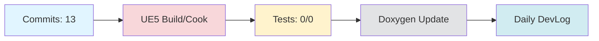

# Daily DevLog — 2025-11-20 (목)

**범위**:  ~ 
**브랜치**: main / 베이스: 
**릴리즈 타겟**: 

---

## 1. 오늘의 핵심 변경 (Top Changes)

- [feat] feat: 드로잉보드 위젯에 캔버스 초기화 및 저장 기능 추가하고 NPCExaminer에 동적 재질 적용 — 영향: 기능 추가

- [feat] feat: 네트워크 테스트 기능 확장 및 신규 API 연동 추가 — 영향: 기능 추가

- [feat] feat: 사용자 등록 및 인증 API 연동 기능 추가 — 영향: 기능 추가

### Commit Heatmap
- 총 커밋: 13
- 변경 라인: +2076 / -97
- 영향 파일: N/A

---

## 2. 시스템 영향도 (Impact)

### 성능

- 로딩: 데이터 없음

### 안정성

- 크래시:  → 
- 실패 빌드: 

### 네트워크

- 네트워크: 데이터 없음

---

## 3. 검증 (Verification)

### 빌드 (UE5)

- 빌드 정보 없음

### 테스트

- 단위/통합/에디터 테스트: /

### 정적분석

- 경고:  → 
- 신규 심각도(High): 

---

## 4. 코드 문서화 변화 (Doxygen Delta)

- API 변화 없음

---

## 5. 리팩토링·위험 이슈

### 리팩토링

- 리팩토링 없음

### 위험

- 위험 항목 없음

---

## 6. 내일(Next)·미진(Action)

### Next

- 계획된 작업 없음

### 미진

- 미진 작업 없음

---

## 7. Mermaid 개요도

---

**생성 시간**: 2025-11-21 10:20:33 KST